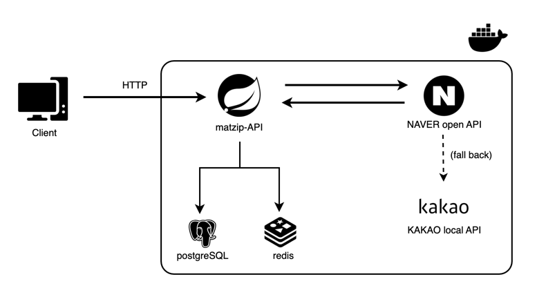

# 🍜 HPL 맛집 검색 서비스 인프라 구성도 해설

---

## ✅ 아키텍처 개요

이 인프라 구성도는 **Spring Boot 기반의 맛집 검색 API 서버**가 외부 API(Naver/Kakao)와 통신하며, 내부 Redis/PostgreSQL과 상호작용하는 구조를 보여줍니다.

---

## ⚙️ 구성 요소 설명

### 1. **Client (사용자)**

* 사용자는 브라우저나 모바일에서 `HTTP` 요청을 보냅니다.
* 요청은 `/search`, `/popular` 등의 엔드포인트를 호출합니다.

### 2. **matzip-API (Spring Boot 앱)**

* 핵심 애플리케이션 서버로, 모든 비즈니스 로직을 담당합니다.
* 다음 역할을 수행합니다:

    * 외부 API를 통한 맛집 검색 (Naver → fallback → Kakao)
    * 인기 키워드 Redis 기록
    * 검색 기록 PostgreSQL 저장

### 3. **NAVER open API**

* 기본적인 맛집 검색을 수행하는 외부 API입니다.
* 쿼리 기반으로 지역/키워드 검색 결과를 제공합니다.

### 4. **KAKAO local API (fallback)**

* Naver API 장애 또는 실패 시 **전략 패턴 기반으로 자동 전환**되는 대체 API입니다.
* 장애 허용성과 고가용성 구조를 위해 도입되었습니다.

### 5. **PostgreSQL**

* 검색 히스토리 로그를 저장하는 RDB입니다.

### 6. **Redis**

* 실시간 인기 키워드 집계를 위한 **ZSET 기반 캐시 저장소**입니다.
* `/popular` API의 빠른 응답을 위한 핵심 캐시 계층입니다.

### 7. **Docker 컨테이너화**

* 모든 서비스는 도커 기반으로 컨테이너화되어 배포됩니다.
* `docker-compose`를 통해 단일 네트워크로 관리될 수 있으며, 확장성에도 유리합니다.

작성일: 2025-05-30
작성자: 이준열
