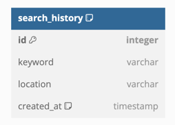

# 시스템 개요서

## 1. 시스템 전체 흐름 요약

사용자는 키워드와 지역 정보를 입력해 맛집을 검색합니다. 검색 요청은 우선순위에 따라 외부 API(Naver)를 호출하고, 실패 시 Kakao API로 대체됩니다. 응답된 검색 결과는 클라이언트에 반환되며, 동시에 검색 키워드는 DB와 Redis에 저장되어 인기 키워드 집계에 사용됩니다.

---

## 2. ERD (Entity-Relationship Diagram)

현재 시스템에서는 검색어 저장을 위한 단일 테이블 구조로 설계됩니다.

* **search\_history**

    * id (PK)
    * keyword (검색 키워드)
    * location (검색 지역)
    * searched\_at (검색 시간)

> 인기 키워드 집계는 Redis ZSET을 사용하며, DB는 백업 및 분석 목적입니다.

---

## 3. 시퀀스 다이어그램

### 3.1 맛집 검색 요청 흐름

1. Client → `/search?keyword=국밥&location=오산세교`
2. API 서버 → Naver API 요청
3. 실패 시 → Kakao API 요청으로 대체
4. 응답 결과를 클라이언트로 반환
5. 동시에 검색어를 DB(`search_history`)와 Redis에 저장

📌 시퀀스 다이어그램: 검색 요청 흐름 mermaid code

### 3.2 인기 키워드 조회 흐름

1. Client → `/popular?location=강남역`
2. API 서버 → Redis ZSET에서 조회 후 응답

---

## 4. 외부 API 장애시 대응 방법 클래스 다이어그램

### 전략 패턴 기반 검색 서비스 구조

이번 검색 시스템은 **전략 패턴(Strategy Pattern)** 을 활용하여, 외부 API(Naver 또는 Kakao)를 유연하게 사용할 수 있도록 설계되었습니다.

### 주요 구성 요소

- **`SearchStrategy` (Interface)**  
  검색 전략을 정의하는 인터페이스로, 모든 검색 전략 클래스는 이 인터페이스를 구현해야 합니다.
    - `search(keyword, location): SearchResult`

- **`NaverSearchStrategy implements SearchStrategy`**  
  Naver 지역 검색 API를 호출하는 전략 클래스입니다.
    - 실패 발생 시 예외를 던져 `SearchContext`에서 대체 전략을 사용할 수 있도록 합니다.

- **`KakaoSearchStrategy implements SearchStrategy`**  
  Kakao 지역 검색 API를 호출하는 전략 클래스입니다.
    - Naver API 실패 시 fallback 용도로 사용됩니다.

- **`SearchContext`**  
  현재 적용 중인 `SearchStrategy`를 내부적으로 보유하며, 상황에 따라 전략을 교체할 수 있습니다.
    - `setStrategy()`를 통해 전략 변경이 가능합니다.
    - `search()` 메서드는 현재 설정된 전략 객체의 메서드를 위임 실행합니다.

- **`SearchService`**  
  외부에 노출되는 서비스 계층으로, 실제 API 요청을 처리합니다.
    - 내부적으로 `SearchContext`를 사용하며, 기본적으로 `NaverSearchStrategy`로 설정되지만, 예외 발생 시 `KakaoSearchStrategy`로 교체합니다.

### 처리 흐름 요약

1. 사용자가 검색을 요청하면, `SearchService`는 내부적으로 `SearchContext`를 통해 `search()`를 호출합니다.
2. `SearchContext`는 현재 설정된 전략(`NaverSearchStrategy`)을 통해 검색을 수행합니다.
3. 만약 실패(Exception 발생) 시, `SearchContext`는 `KakaoSearchStrategy`로 전략을 변경하고 재시도합니다.
4. 최종 결과를 `SearchService`가 받아 클라이언트에게 반환합니다.
---
## 4. 외부 API 장애시 대응 방법 클래스 다이어그램 (확장)

### 전략 패턴 + 어댑터 패턴 기반 검색 서비스 구조

---

### 🧩 핵심 설계 요약

본 시스템은 **전략 패턴(Strategy Pattern)** 과 **어댑터 패턴(Adapter Pattern)** 을 조합하여 다음과 같은 목적을 달성합니다:

| 구성요소 | 역할 |
|----------|------|
| `SearchStrategy` | 검색 로직을 추상화한 전략 인터페이스 |
| `NaverSearchStrategy`, `KakaoSearchStrategy` | 각각 Naver, Kakao API 호출을 구현한 전략 |
| `SearchContext` | 현재 전략을 위임 실행하고, 예외 발생 시 다른 전략으로 fallback |
| `NaverRawResponse`, `KakaoRawResponse` | 외부 API의 응답 포맷에 맞는 구조체 |
| `SearchResultAdapter` | 서로 다른 RawResponse를 하나의 통일된 `UnifiedPlaceDto`로 변환 |
| `UnifiedPlaceDto` | 클라이언트에게 응답되는 표준화된 DTO |

---

### 🔁 처리 흐름 정리

1. 클라이언트가 `/search`로 검색 요청을 보냅니다.
2. `SearchService`는 기본 전략(Naver)을 통해 `SearchContext`에 요청을 위임합니다.
3. `SearchContext`는 현재 전략 객체의 `search()` 메서드를 호출합니다.
4. 결과로 `NaverRawResponse` 또는 `KakaoRawResponse`를 받아옵니다.
5. `SearchResultAdapter`가 RawResponse를 `UnifiedPlaceDto`로 변환합니다.
6. 클라이언트에게 응답을 전달하고, 동시에 Redis와 DB에 검색어를 저장합니다.

---

### ✍️ 확장 고려사항

- 추후 API 제공자가 추가되더라도 `SearchStrategy`만 구현하면 시스템 전체 변경 없이 쉽게 확장할 수 있습니다.
- `SearchResultAdapter`는 다형성을 고려하여 `Map<Class<?>, Adapter>` 매핑 테이블 구조로 설계할 수 있습니다.
- 장애 로깅, 응답 시간 모니터링 등을 미들웨어 또는 AOP 레벨에서 확장 가능합니다.

---

📝 **작성일:** 2025-05-30  
📝 **수정일:** 2025-06-12

🧑‍💻 **작성자:** 이준열
